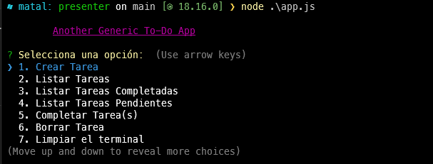

# AnotherGenericToDo

CLI built to serve as a To-Do, with this app you can manage your tasks, visualize them, complete them and add due dates.

## Capabilities

This CLI program will allow you to manage your tasks on a day-to-day basis, among the capabilities found within the program are:

* Create tasks (with deadline)
* List all tasks
* List pending or completed tasks
* Complete tasks (obviously)
* Delete tasks

In addition, each task is encrypted with SHA-256, so a unique code is generated in each task for security issues within the application.

## Preview

